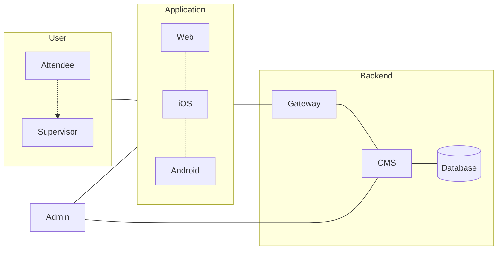

# scaling-barnacle

## Goal

## System

```mermaid
flowchart LR;
    subgraph User;
        direction TB;
        %% ~~~ does not work
        Attendee -.-> Supervisor
        %% Looks bad
        %% Admin --- CMS
    end;
    subgraph Application
        direction TB
        Web -.- iOS -.- Android
    end
    subgraph Backend
        direction LR
        Gateway --- CMS
        CMS --- database[(Database)]
    end
    User --- Application
    Admin --- Application
    Admin --- CMS
    Application --- Gateway
```

### Literature
* https://strapi.io/blog/real-time-chat-application-using-strapi-next-socket-io-and-postgre-sql
