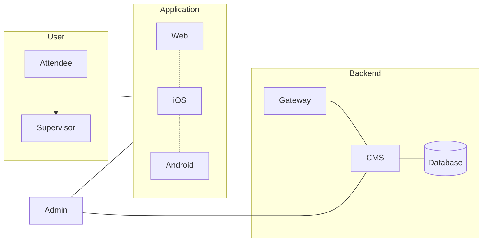

# scaling-barnacle

## Goal

Create a Managment system to keep track of attendees during a youth camp

## System

### Frontend

Either [react-native](https://reactnative.dev/) or [flutter](https://flutter.dev/multi-platform).
If we use nodejs in the backend, react-native would use development time and increase overall type safety.
Since we could use typescript in front- and back-end.

If [pocketbase](https://pocketbase.io/docs/) probably flutter is the better choice for the frontend since it has a full supported dart [library](https://github.com/pocketbase/dart-sdk).

#### React Native

* Build everything in react native use [react-native-web](https://necolas.github.io/react-native-web/) to transform components for the web.
* Routing mobile [react-navigation](https://reactnavigation.org/)
* Routing web either react-navigation or maybe easier [nextjs](https://nextjs.org/) !Clear routing and page seperation will be needed in the project

### Backend

#### Possibilites
* https://pocketbase.io/docs/
* https://supabase.com/docs 

#### Literature
* https://strapi.io/blog/real-time-chat-application-using-strapi-next-socket-io-and-postgre-sql
